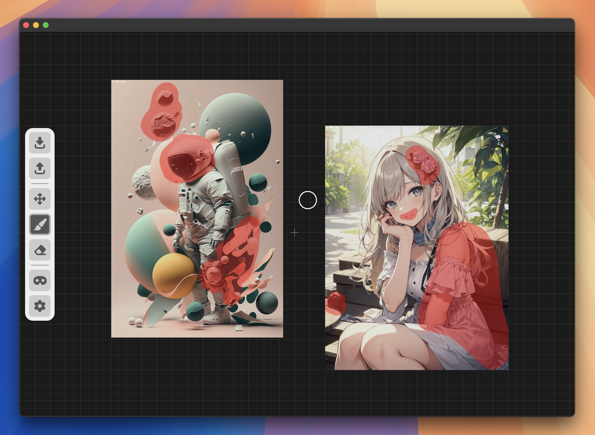
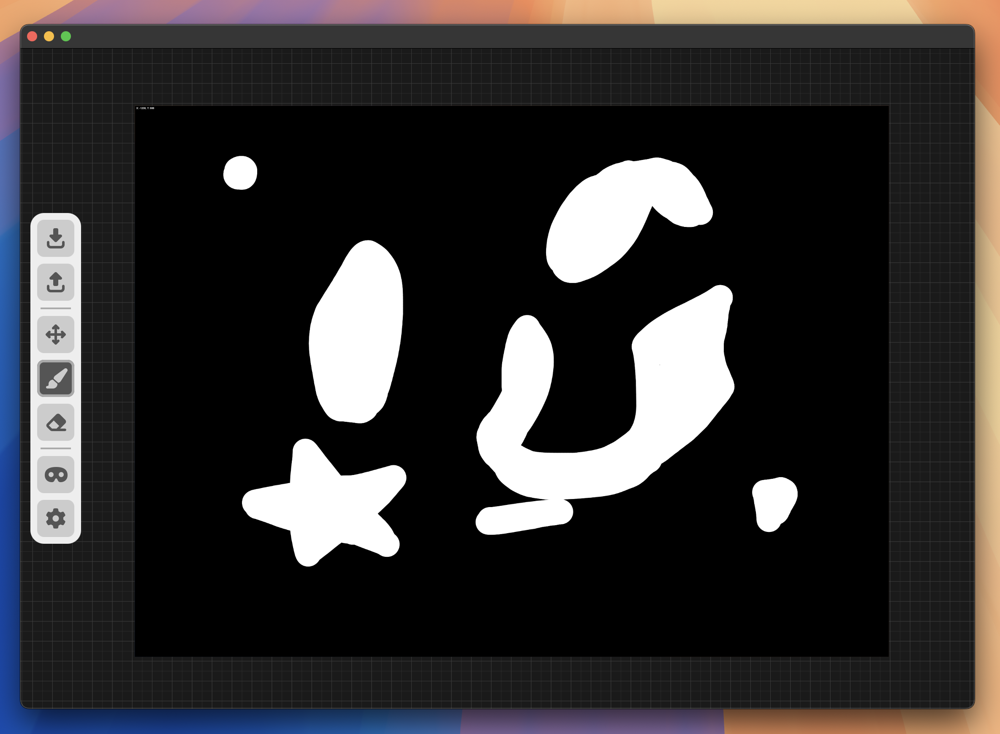

# InPaint UI (Canvas for Creating InPainting Masks)
**Try It:** https://zacheryvaughn.github.io/inpaint-ui/

___
**Masking Features:**
- Import Images (can work with multiple)
- Paint and Erase Mask Area
- Adjust Mask Opacity
- Preview Mask Product (0-3 seconds to process)
- Feather Mask Edge
- Adjust Feather Offset (from fully inset to fully outset)
- Invert Mask (at export and preview)
- Export Mask Image (mask that was most recently touched)

___
**Canvas Features:**
- Centered Origin
- Dynamic Gridlines
- Canvas Drag-Panning
- Cursor-Focused Zoom
- Snap-to-Grid Dragging
- Auto Z-Index Swapping

___
**Canvas Mouse Controls:**
- Scroll Wheel: Zoom Canvas
- Hold Right Mouse Button: Move Canvas
- Click Scroll Wheel Button: Re-Center Canvas
- Hold Left Mouse Button: Drag Item

___

